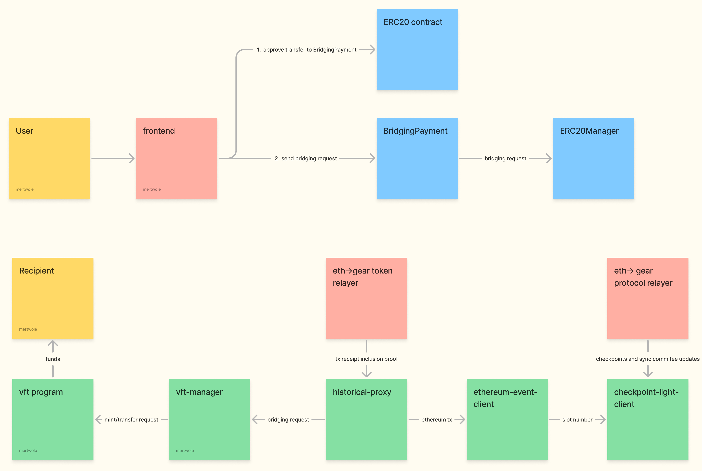

# Gear Bridges

Gear Bridge is an implementation of a trustless ZK-based cross-chain bridge facilitating the transfer of assets between Ethereum and Gear-based blockchains, such as the [Vara network](https://vara.network/).

## Security

[Ethernal](https://ethernal.tech/) team have performed partial [audit](audits/ethernal.pdf) of the code, which covered the following scope for the commit [d42251c](https://github.com/gear-tech/gear-bridges/commit/d42251c3c9d94309a7855d6d774c6054a139a674):

- [prover](https://github.com/gear-tech/gear-bridges/tree/d42251c3c9d94309a7855d6d774c6054a139a674/prover)
- `plonky2` [circuits](https://github.com/gear-tech/gear-bridges/tree/d42251c3c9d94309a7855d6d774c6054a139a674/circuits) for crypto primitives
- `ethereum` [smart-contracts](https://github.com/gear-tech/gear-bridges/tree/d42251c3c9d94309a7855d6d774c6054a139a674/ethereum)

> [!WARNING]
> One of the conclusions of this audit was that malicious node which relayer is connected to can cause the proof generation process to be halt. So all deployed relayers **MUST** use their own dedicated gear node which is known to be non-malicious.

They've also performed another [audit](audits/ethernal_2.pdf) which covered the following scope for the commit [8b1018bd](https://github.com/gear-tech/gear-bridges/tree/8b1018bd8a2b882a2b9d4fc84c12666144b54efd):

- `gear` [programs](https://github.com/gear-tech/gear-bridges/tree/8b1018bd8a2b882a2b9d4fc84c12666144b54efd/gear-programs)
- `ethereum` [smart-contracts](https://github.com/gear-tech/gear-bridges/tree/8b1018bd8a2b882a2b9d4fc84c12666144b54efd/ethereum/src)

## High-Level Design

The **Gear <-> Eth** transfer protocol allows relaying messages from Gear-based blockchains to Ethereum and back. These messages contain generic data defined by protocols built on top of the bridge. The protocol doesn't guarantee the order in which messages are relayed.

This repository contains the implementation of a token bridging protocol built on top of a more generic messaging protocol.

### Components of `Gear <-> Eth` bridge


<details>
    <summary>Detailed diagram</summary>
    
</details>

#### Protocol part

- **Pallet-Gear-Eth-Bridge Built-in Actor**: a [Built-in Actor](https://wiki.gear-tech.io/docs/gear/features/builtin-actors) - the entry point into the generic bridging protocol. Receives messages from any actor on the Gear network and relays them to `pallet-gear-eth-bridge`.
- **Pallet-Gear-Eth-Bridge**: Receives messages from the `pallet-gear-eth-bridge` built-in actor and stores them in the binary Merkle trie. This Merkle trie gets slashed at the end of each `ERA`. Also stores and updates hashed `GRANDPA` authority set.
- **Relayer(proxy)[^1]**: Accepts proofs of Merkle trie root inclusion and, if they're valid, stores Merkle trie roots in memory. Deployed behind [ERC-1967 Proxy](https://eips.ethereum.org/EIPS/eip-1967).
- **Verifier**: A contract capable of verifying `plonk` proofs created by [gnark](https://github.com/Consensys/gnark). The submitted proofs are [plonky2](https://github.com/0xPolygonZero/plonky2) proofs wrapped by `gnark`.
- **MessageQueue(proxy)[^1]**: Used to recover messages from Merkle tries. A user can request a message to be relayed further onto Ethereum by providing proof of inclusion of a message actually included in the Merkle trie, given that this Merkle root was already relayed by `gear->eth protocol relayer` (or another party). This is also the exit point of the generic Gear -> Eth bridging protocol.
- **Checkpoint-Light-Client**: Lazy ethereum light client that maintains `sync committee` validator list and is capable of verifying block headers using it.
- **Ethereum-Event-Client**: Program on Gear that's capable of verifying that some event was included into some block. To check validity of the block it requests data from `checkpoint-light-client`.
- **Historical-Proxy**: Program on Gear that maintains historical `ethereum-event-client` program addresses and redirects requests to a `ethereum-event-client` responsible of processing requested transaction. Serves as an exit point from core Ethereum -> Gear protocol.
- **Gear -> Eth Protocol Relayer**: Reads Gear state, generates ZK-proofs, and submits them to Ethereum. Capable of creating two types of ZK-proofs: proof of authority set changes and proof of inclusion of Merkle trie root into the storage of `pallet-gear-eth-bridge`. Proofs of authority set changes are intermediate and stored in on-chain `proof storage` while proofs of Merkle trie root inclusion are submitted to Ethereum.
- **Eth -> Gear Protocol Relayer**: Relayer that monitors `sync committee` changes and blocks signed by it on Ethereum and updates state of `checkpoint-light-client` using it.

#### Token transfer part

- **VFT**: A program capable of transferring, burning, and minting `vft` tokens. It repeats the implementation of the `ERC20` standard on the Gear network, the standard implementation `vft` can be found [here](https://github.com/gear-foundation/standards/tree/master).
- **VFT-Manager**: Receives `vft` tokens from users, burns/locks them, and emits a message to the `pallet-gear-eth-bridge` built-in actor. This message contains information about which token is being bridged, how much of it, and the recipient of funds on the Ethereum network. Also manages `Eth -> Gear` token transfers by verifying ethereum events using `historical-proxy` program and minting/unlocking corresponding tokens. It can work with both Ethereum and Gear supplied tokens. When token supply is based on Ethereum it will perform burns and mints of corresponding `VFT` tokens. When token supply is based on Gear it will perform locks and unlocks of corresponding `VFT` tokens.
- **ERC20Manager(proxy)[^1]**: Mirroring behaviour of `vft-manager` but on Ethereum side and without sending request to a `pallet-gear-eth-bridge`.
- **Bridging Payment**: Program on Gear and smart-contract on Ethereum that have the same functions. When bridging request is sent to them, they collect fees and relay this request to the corresponding smart-contract/program responsible of executing this request. Then some `token relayer` can observe events signaling that request have been processed and fee is paid and process this request on the other chain, using its own funds as tx fees. `bridging payment` services are fully in control of relayer that've deployed them, so to perform bridging using them one should trust the owner.
- **Gear -> Eth Token Relayer** and **Eth -> Gear Token Relayer**: These relayers hook to the events produced by `bridging payment` services and perform cross-chain actions to guarantee message delivery. For example, `gear -> eth token relayer` collects bridging fees from user on Gear. When merkle root that contain this message will be relayed to Ethereum, this relayer will send transaction to the `MessageQueue` that will trigger transfer from `ERC20Manager` to the user.

### Workflow of `Gear -> Ethereum` Token[^2] Transfer


- The user submits his bridging request to `frontend`
- `frontend` submits `approve` call to the `vft` program. Approve should allow `vft-manager` to spend amount of tokens that user have requested to bridge.
- `frontend` submits user request to the `bridging-payment`.
- `bridging-payment` takes fee and submits a message to the `vft-manager` to initiate bridging.
- The `vft-manager` burns/locks `vft` tokens and emits a message to the `pallet-gear-eth-bridge` built-in actor.
- The `pallet-gear-eth-bridge` built-in actor relays the message to `pallet-gear-eth-bridge`.
- The `pallet-gear-eth-bridge` stores the message in a Merkle trie.
- Eventually, the `gear->eth protocol relayer` (or another party) relays the message to the `Relayer` contract, and it gets stored there.
- `gear->eth token relayer` sees that user message was relayed and submits a Merkle proof of inclusion to the `MessageQueue` contract.
- The `MessageQueue` contract reads the Merkle root from the `Relayer` contract, checks the Merkle proof, and relays the message to the `ERC20Manager`.
- The `ERC20Manager` releases funds to the user's account on Ethereum.

### Workflow of `Ethereum -> Gear` Token[^2] Transfer



- The user submits his bridging request to `frontend`
- `frontend` submits `approve` call to the corresponding `ERC20` contract. Approve should allow `BridgingPayment` to spend amount of tokens that user have requested to bridge.
- `frontend` submits user request to the `BridgingPayment`.
- The `ERC20Manager` locks/burns `ERC20` tokens and emits an event.
- Eventually, the `eth->gear protocol relayer` (or another party) sumbits to `checkpoint-light-client` ethereum block which has block number bigger than one where event have been emitted.
- Eventually, the `eth->gear token relayer` (or another party) submits this event to `historical-proxy`
- `historical-proxy` verifies this event by sending a message to `ethereum-event-client`.
- `ethereum-event-client` verifies that block where event is present is a valid finalized block on ethereum by calling `checkpoint-light-client`.
- `historical-proxy` routes user bridging request to `vft-manager`
- `vft-manager` sends message to a `vft` program that corresponds to a `ERC20` token that've been locked/burned in step 4. This message is either `transfer`(in the case when token supply is on Gear) or `mint`(in the case when token supply is on Ethereum).
- `vft` program mints/transfers tokens to a user address.

## Build and run

### Prerequisites

Install rust:
```sh
curl --proto '=https' --tlsv1.2 -sSf https://sh.rustup.rs | sh
```

Install golang: [golang installation](https://go.dev/doc/install)

Install forge:
```sh
curl -L https://foundry.paradigm.xyz | bash
foundryup
```

> [!NOTE]
> To build `ring` crate follow [BUILDING.md](https://github.com/gear-tech/ring/blob/main/BUILDING.md).

### Run relayer

Build workspace:
```sh
cargo build --release -p relayer
```

And then run
```sh
./target/release/relayer --help
```
to see required parameters to start different kinds of relayers.

[^1]: (proxy) means that this contract is deployed behind [ERC-1967 Proxy](https://eips.ethereum.org/EIPS/eip-1967)

[^2]: Gear itself is not a blockchain network and has no native token. This refers to the token of any network built on Gear technology, such as Vara.
