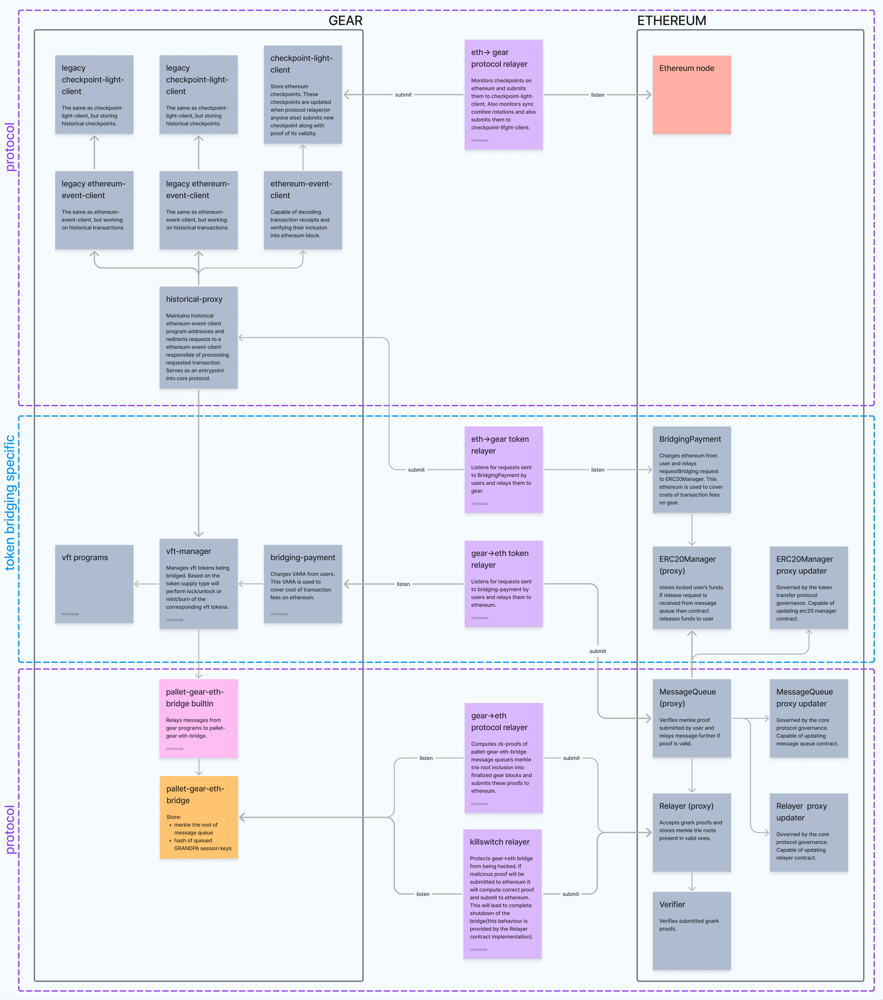
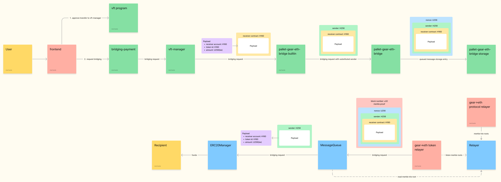

# Gear Bridges

Gear Bridge is an implementation of a trustless ZK-based cross-chain bridge facilitating the transfer of assets between Ethereum and Gear-based blockchains, such as the [Vara network](https://vara.network/).

## Security

> [!NOTE]
> This code has not yet been fully audited and therefore shouldn't be used in production.

[Ethernal](https://ethernal.tech/) team have performed partial [audit](audits/ethernal.pdf) of the code, which covered the following scope for the commit [d42251c](https://github.com/gear-tech/gear-bridges/commit/d42251c3c9d94309a7855d6d774c6054a139a674):

- [prover](https://github.com/gear-tech/gear-bridges/tree/d42251c3c9d94309a7855d6d774c6054a139a674/prover)
- `plonky2` [circuits](https://github.com/gear-tech/gear-bridges/tree/d42251c3c9d94309a7855d6d774c6054a139a674/circuits) for crypto primitives
- `ethereum` [smart-contracts](https://github.com/gear-tech/gear-bridges/tree/d42251c3c9d94309a7855d6d774c6054a139a674/ethereum)

## High-Level Bi-Directional `Gear <-> Eth` Design

The **Gear <-> Eth** transfer protocol allows relaying messages from Gear-based blockchains to Ethereum and back. These messages consist of generic data defined by protocols built on top of the bridge. The protocol doesn't guarantee the order in which messages are relayed.

This repository contains the implementation of a token bridging protocol built on top of a more generic messaging protocol.

### Components Present in `Gear <-> Eth` Bridge



#### Protocol part

- **Pallet-Gear-Eth-Bridge Built-in Actor**: a [Built-in Actor](https://wiki.gear-tech.io/docs/gear/features/builtin-actors) - the entry point into the generic bridging protocol. Receives messages from any actor on the Gear network and relays them to `pallet-gear-eth-bridge`.
- **Pallet-Gear-Eth-Bridge**: Receives messages from the `pallet-gear-bridges` built-in actor and stores them in the binary Merkle trie. This Merkle trie gets slashed at the end of each `ERA`. Also stores and updates hashed `GRANDPA` authority set.
- **Gear -> Eth Relayer**: Reads Gear state, generates ZK-proofs, and submits them to Ethereum. Capable of creating two types of ZK-proofs: proof of authority set changes and proof of inclusion of Merkle trie root into the storage of `pallet-gear-eth-bridge`. Proofs of authority set changes are intermediate and stored in on-chain `proof storage` while proofs of Merkle trie root inclusion are submitted to Ethereum.
- **Proof Storage**: Works as on-chain proof database and stores intermediate proofs generated by `gear -> eth relayer`.
- **Relayer Contract**: Accepts proofs of Merkle trie root inclusion and, if they're valid, stores Merkle trie roots in memory.
- **Gnark-Verifier**: A contract capable of verifying `plonk` proofs created by [gnark](https://github.com/Consensys/gnark). The submitted proofs are [plonky2](https://github.com/0xPolygonZero/plonky2) proofs wrapped by `gnark`.
- **Message Queue Contract**: Used to recover messages from Merkle tries. A user can request a message to be relayed further onto Ethereum by providing proof of inclusion of a message actually included in the Merkle trie, given that this Merkle root was already relayed by `backend` (or another party). This is also the exit point of the generic Gear -> Eth bridging protocol.
- **Ethereum Block client**: Lazy ethereum light client that maintains `sync committee` validator list and is capable of verifying block headers using it.
- **Eth -> Gear relayer**: Relayer that monitors `sync committee` changes and blocks signed by it on Ethereum and updates state of `ethereum block client` using it.

#### Token transfer part

- **GRC-20**: A program capable of transferring, burning, and minting `GRC-20` tokens. It repeats the implementation of the `ERC20` standard on the Gear network, the standard implementation `GRC-20` can be found [here](https://github.com/gear-foundation/standards/tree/master/gear-erc20).
- **GRC-20 Gateway**: Receives `GRC-20` tokens from users, burns them, and emits a message to the `pallet-gear-eth-bridge` built-in actor. This message contains information about which token is being bridged, how much of it, and the recipient of funds on the Ethereum network. Also manages `Eth -> Gear` token transfers by verifying ethereum events using `ethereum event client` program.
- **ERC20 Treasury**: A treasury that accepts user funds and releases them. Release can only be triggered by a message relayed over the bridge from the `GRC-20 gateway`.
- **Bridging Payment**: Program on Gear and smart-contract on Ethereum that have the same functions. When bridging request is sent to them, they collect fees and relay this request to the corresponding smart-contract/program responsible of executing this request. Then some `token transfer relayer` can observe events signaling that request have been processed and fee is paid and process this request on the other chain, using its own funds as tx fees. `Bridging payment` services are fully in control of relayer that've deployed them, so to perform bridging using them one should trust the relayer that've deployed them.
- **Ethereum Event client**: Program on Gear that's capable of verifying that some event was included into some block. To check validity of the block it requests data from `ethereum block client`.
- **Gear -> Eth Token Transfer Relayer** and **Eth -> Gear Token Transfer Relayer**: These relayers hook to the events produced by `bridging payment` services and perform cross-chain actions to guarantee message delivery. For example, `gear -> eth token transfer relayer` collects bridging fees from user on Gear. When merkle root that contain this message will be relayed to Ethereum, this relayer will send transaction to the `message queue contract` that will trigger transfer from `ERC20 treasury` to the user.

### Workflow of `Gear -> Eth` Token* Transfer

> [!NOTE]
> *Gear itself is not a blockchain network and has no native token. This refers to the token of any network built on Gear technology, such as Vara.



- The user submits a message to the `GRC-20 gateway` to initiate bridging.
- The `GRC-20 gateway` burns `GRC-20` tokens and emits a message to the `pallet-gear-bridge` built-in actor.
- The `pallet-gear-bridge` built-in actor relays the message to `pallet-gear-bridge`.
- The `pallet-gear-bridge` stores the message in a Merkle trie.
- Eventually, the `backend` (or another party) relays the message to the `relayer contract`, and it gets stored there.
- The user sees that their message was relayed and submits a Merkle proof of inclusion to the `message queue contract`.
- The `message queue contract` reads the Merkle root from the `relayer contract`, checks the Merkle proof, and relays the message to the `ERC20 treasury`.
- The `ERC20 treasury` releases funds to the user's account on Ethereum.

## Prover Circuits

### Block Finality

The Block Finality circuit proves that a specific block was finalized by an authority set on the Gear chain. This involves verifying that a majority (>2/3) of validators have signed the GRANDPA vote for the block.


### Validator Set Change

The Validator Set Change circuit proves that the validator set has changed. This change means that the current validator set finalized a block containing the next validator set in its storage. The circuit verifies that a majority of validators from the current set have set hash inclusion into the storage of `pallet-gear-bridge` and signed the vote for the change.


### Substrate Storage Trie Circuits

Substrate storage trie circuits are used to prove the inclusion of data into the Substrate storage trie. Currently, there are two types of nodes supported:

#### Branch Node Without Value

This circuit parses branch nodes in the trie, which do not contain a value but help navigate the structure.


#### Hashed Value Leaf

This circuit parses leaf nodes in the trie, which contain the hashed values of the stored data.


These individual proofs are composed into a storage proof, which proves that specific data exists at a particular address within a block's storage.


### Recent Validator Set

The Recent Validator Set circuit is used to prove a chain of validator set changes, demonstrating the transition from the genesis validator set to the most recent validator set. The genesis validator set is encoded as a constant within the circuit.


### Message Inclusion

The Message Inclusion circuit is used to prove that a specific message Merkle root was submitted on the Gear chain for bridging, indicating its inclusion in the `pallet-gear-bridge` storage.


### Final Proof

The Final Proof circuit is the proof submitted to Ethereum. It proves that a message Merkle root was present in the storage of `pallet-gear-bridge` at a specific finalized block. This final proof ensures the validity of the cross-chain message.


## Build and run

### Prerequisites

Install rust:
```sh
curl --proto '=https' --tlsv1.2 -sSf https://sh.rustup.rs | sh
```

Install golang: [golang installation](https://go.dev/doc/install)

Install forge:
```sh
curl -L https://foundry.paradigm.xyz | bash
foundryup
```

> [!NOTE]
> To build `ring` crate follow [BUILDING.md](https://github.com/gear-tech/ring/blob/main/BUILDING.md).

### Run relayer

Build workspace:
```sh
cargo build --release
```

And then run
```sh
cargo run --release -- --help
```
to see required parameters to start relayer.
