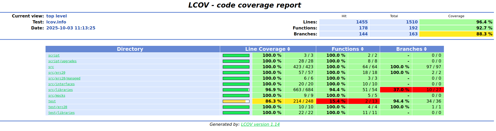

### Coverage Report

For Ethereum contracts, we have nearly 100% code coverage (except for the `PlonkVerifier` contract). To generate detailed HTML code coverage report, follow the instructions in `ethereum/README.md`. This means that our tests cover almost all code branches in Ethereum smart contract.

```shell
$ forge test
$ forge coverage
```

The output of `forge coverage` is shown below:

```
Ran 15 test suites in 741.48s (2827.10s CPU time): 111 tests passed, 0 failed, 0 skipped (111 total tests)

╭------------------------------------------+--------------------+--------------------+------------------+------------------╮
| File                                     | % Lines            | % Statements       | % Branches       | % Funcs          |
+==========================================================================================================================+
| script/Deployment.s.sol                  | 100.00% (3/3)      | 100.00% (1/1)      | 100.00% (0/0)    | 100.00% (2/2)    |
|------------------------------------------+--------------------+--------------------+------------------+------------------|
| script/upgrades/ERC20Manager.s.sol       | 100.00% (7/7)      | 100.00% (6/6)      | 100.00% (0/0)    | 100.00% (2/2)    |
|------------------------------------------+--------------------+--------------------+------------------+------------------|
| script/upgrades/MessageQueue.s.sol       | 100.00% (7/7)      | 100.00% (6/6)      | 100.00% (0/0)    | 100.00% (2/2)    |
|------------------------------------------+--------------------+--------------------+------------------+------------------|
| script/upgrades/Verifier.s.sol           | 100.00% (7/7)      | 100.00% (6/6)      | 100.00% (0/0)    | 100.00% (2/2)    |
|------------------------------------------+--------------------+--------------------+------------------+------------------|
| script/upgrades/WrappedVara.s.sol        | 100.00% (7/7)      | 100.00% (6/6)      | 100.00% (0/0)    | 100.00% (2/2)    |
|------------------------------------------+--------------------+--------------------+------------------+------------------|
| src/BridgingPayment.sol                  | 100.00% (19/19)    | 100.00% (14/14)    | 100.00% (3/3)    | 100.00% (6/6)    |
|------------------------------------------+--------------------+--------------------+------------------+------------------|
| src/ERC20Manager.sol                     | 100.00% (179/179)  | 100.00% (178/178)  | 100.00% (35/35)  | 100.00% (29/29)  |
|------------------------------------------+--------------------+--------------------+------------------+------------------|
| src/GovernanceAdmin.sol                  | 100.00% (50/50)    | 100.00% (48/48)    | 100.00% (15/15)  | 100.00% (3/3)    |
|------------------------------------------+--------------------+--------------------+------------------+------------------|
| src/GovernancePauser.sol                 | 100.00% (42/42)    | 100.00% (38/38)    | 100.00% (13/13)  | 100.00% (3/3)    |
|------------------------------------------+--------------------+--------------------+------------------+------------------|
| src/MessageQueue.sol                     | 100.00% (128/128)  | 100.00% (128/128)  | 100.00% (29/29)  | 100.00% (22/22)  |
|------------------------------------------+--------------------+--------------------+------------------+------------------|
| src/Verifier.sol                         | 100.00% (5/5)      | 100.00% (3/3)      | 100.00% (2/2)    | 100.00% (1/1)    |
|------------------------------------------+--------------------+--------------------+------------------+------------------|
| src/erc20/CircleToken.sol                | 100.00% (4/4)      | 100.00% (2/2)      | 100.00% (0/0)    | 100.00% (2/2)    |
|------------------------------------------+--------------------+--------------------+------------------+------------------|
| src/erc20/TetherToken.sol                | 100.00% (4/4)      | 100.00% (2/2)      | 100.00% (0/0)    | 100.00% (2/2)    |
|------------------------------------------+--------------------+--------------------+------------------+------------------|
| src/erc20/WrappedEther.sol               | 100.00% (13/13)    | 100.00% (13/13)    | 100.00% (2/2)    | 100.00% (3/3)    |
|------------------------------------------+--------------------+--------------------+------------------+------------------|
| src/erc20/WrappedVara.sol                | 100.00% (36/36)    | 100.00% (28/28)    | 100.00% (0/0)    | 100.00% (11/11)  |
|------------------------------------------+--------------------+--------------------+------------------+------------------|
| src/erc20/managed/ERC20GearSupply.sol    | 100.00% (6/6)      | 100.00% (3/3)      | 100.00% (0/0)    | 100.00% (3/3)    |
|------------------------------------------+--------------------+--------------------+------------------+------------------|
| src/interfaces/IERC20Manager.sol         | 100.00% (8/8)      | 100.00% (8/8)      | 100.00% (0/0)    | 100.00% (4/4)    |
|------------------------------------------+--------------------+--------------------+------------------+------------------|
| src/interfaces/IGovernance.sol           | 100.00% (8/8)      | 100.00% (8/8)      | 100.00% (0/0)    | 100.00% (4/4)    |
|------------------------------------------+--------------------+--------------------+------------------+------------------|
| src/interfaces/IMessageQueue.sol         | 100.00% (4/4)      | 100.00% (4/4)      | 100.00% (0/0)    | 100.00% (2/2)    |
|------------------------------------------+--------------------+--------------------+------------------+------------------|
| src/libraries/BinaryMerkleTree.sol       | 100.00% (38/38)    | 100.00% (48/48)    | 100.00% (6/6)    | 100.00% (4/4)    |
|------------------------------------------+--------------------+--------------------+------------------+------------------|
| src/libraries/CustomEnumerableMap.sol    | 100.00% (23/23)    | 100.00% (21/21)    | 100.00% (0/0)    | 100.00% (9/9)    |
|------------------------------------------+--------------------+--------------------+------------------+------------------|
| src/libraries/LibString.sol              | 100.00% (8/8)      | 100.00% (6/6)      | 100.00% (0/0)    | 100.00% (2/2)    |
|------------------------------------------+--------------------+--------------------+------------------+------------------|
| src/libraries/PlonkVerifier.sol          | 96.59% (594/615)   | 94.39% (589/624)   | 19.05% (4/21)    | 92.31% (36/39)   |
|------------------------------------------+--------------------+--------------------+------------------+------------------|
| src/mocks/MessageHandlerMock.sol         | 100.00% (2/2)      | 100.00% (1/1)      | 100.00% (0/0)    | 100.00% (1/1)    |
|------------------------------------------+--------------------+--------------------+------------------+------------------|
| src/mocks/NewImplementationMock.sol      | 100.00% (1/1)      | 100.00% (0/0)      | 100.00% (0/0)    | 100.00% (1/1)    |
|------------------------------------------+--------------------+--------------------+------------------+------------------|
| src/mocks/VerifierMock.sol               | 100.00% (6/6)      | 100.00% (3/3)      | 100.00% (0/0)    | 100.00% (3/3)    |
|------------------------------------------+--------------------+--------------------+------------------+------------------|
| test/Base.sol                            | 86.07% (210/244)   | 90.31% (233/258)   | 94.44% (34/36)   | 0.00% (0/11)     |
|------------------------------------------+--------------------+--------------------+------------------+------------------|
| test/BridgingPayment.t.sol               | 100.00% (4/4)      | 100.00% (3/3)      | 100.00% (0/0)    | 100.00% (2/2)    |
|------------------------------------------+--------------------+--------------------+------------------+------------------|
| test/erc20/WrappedEther.t.sol            | 100.00% (10/10)    | 100.00% (6/6)      | 100.00% (1/1)    | 100.00% (4/4)    |
|------------------------------------------+--------------------+--------------------+------------------+------------------|
| test/libraries/BinaryMerkleTree.t.sol    | 100.00% (4/4)      | 100.00% (4/4)      | 100.00% (0/0)    | 100.00% (2/2)    |
|------------------------------------------+--------------------+--------------------+------------------+------------------|
| test/libraries/CustomEnumerableMap.t.sol | 100.00% (18/18)    | 100.00% (15/15)    | 100.00% (0/0)    | 100.00% (9/9)    |
|------------------------------------------+--------------------+--------------------+------------------+------------------|
| Total                                    | 96.36% (1455/1510) | 95.98% (1431/1491) | 88.34% (144/163) | 92.71% (178/192) |
╰------------------------------------------+--------------------+--------------------+------------------+------------------╯
```

As you can see, the coverage for `src/libraries` is 96.9%, and for `test` it is 86.3%. This is mainly due to the fact that `Base.sol` is an abstract class.




